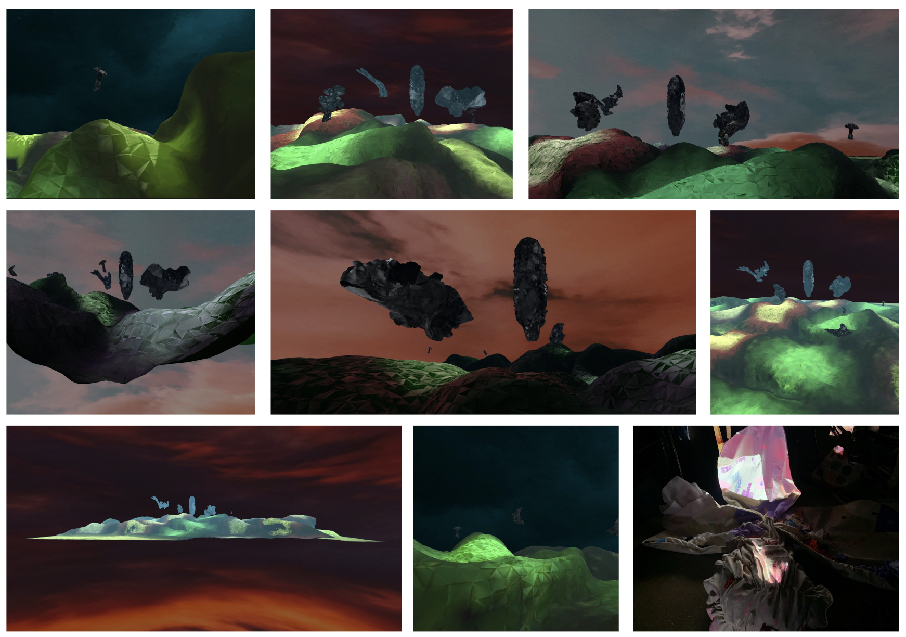

virtual (im)material is a digital world co-created with MC Vigilate that explores dichotomies of
decomposition / composition, material / immaterial, threadedness / glitch.

The scene objects were 3D scanned from natural specimens in the RISD Nature Lab using an Occipital
Structure Sensor and imported into Unity. The landscape terrain was scanned from a hand-constructed
textile, transforming stitches into pixels and fabric folds into hills. This subversion of scale
invites users to encounter familiar objects through a lens of estrangement and discovery. Dynamic
fractal texture mapping adds sensory complexity to obscure the objects’ original forms. The Unity
environment is interactive, with elements such as music, texture, object physics, lighting, and fog
responding to the user’s movements. 

We did not aim to achieve seamless believability nor realistic representation, but rather a
distinctly digital space that emphasizes abstraction and otherworldliness. We embrace the glitch as
both a reminder of our earthly origins and a marker of the imperfect translation between realms.

Our worlding process is a mode of decomposition: compressing subjective sensory forms into discrete
parametrized geometries. Yet it is simultaneously an act of composition: transforming static time
and place bound objects into dynamic assemblages. The representation of the objects become an
experience separate from their tactile embodiment, unrecognizable yet born of the same seed.

The Unity environment was exhibited for Digital Worlding: Terraforming Future, Fact, Fiction, and
Fabulation at Brown University in an installation that included the physical source materials and
original music. Projection of the virtual world onto the original textile completed a full cycle of
physical-to-digital-to-physical translation.

